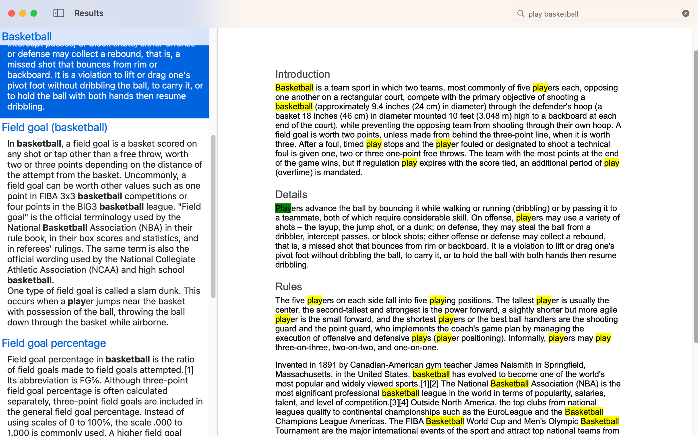

# DocuFinder

DocuFinder is a search enhancement tool for Google Drive, available on both iPad and macOS. It was born out of a personal need to better navigate the wealth of information stored on Google Drive.

Google Drive's search function is robust, yet lacks the ability to show search snippets — a short extract of the content of a document. This makes it hard to identify which document has the content you're looking for when the results list is huge. That's where DocuFinder comes in.

It helps you locate your documents easily through search keywords, providing you with search snippets just like Google Search to enhance your Google Drive search experience.

## Table of Contents

- [Installation](#installation)
- [How it Works](#how-it-works)
- [Feedback and Suggestions](#feedback-and-suggestions)

## Installation

Download DocuFinder from the [App Store](https://apps.apple.com/app/docufinder/id1671818483) on your iPad or macOS device. Then simply log in with your Google Drive account and you're ready to go.

## How It Works

DocuFinder processes your document searches entirely locally, ensuring your private data stays private. Just type in your keyword, and DocuFinder will provide you with snippets from each document in your Google Drive so you can quickly locate the right document.

## Feedback and Suggestions

We value your input! If you have a suggestion or find a bug, please [create an issue](https://github.com/bondxf/docufinder/issues) on this GitHub page. Be sure to include as many details as possible to help us understand your feedback or problem.